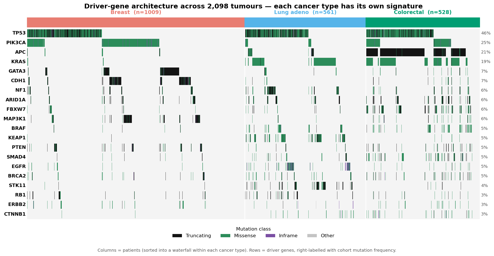
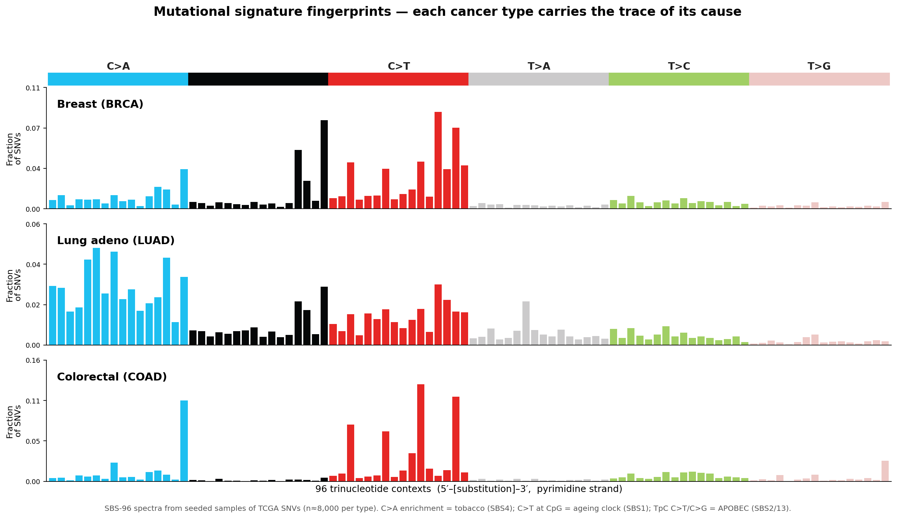
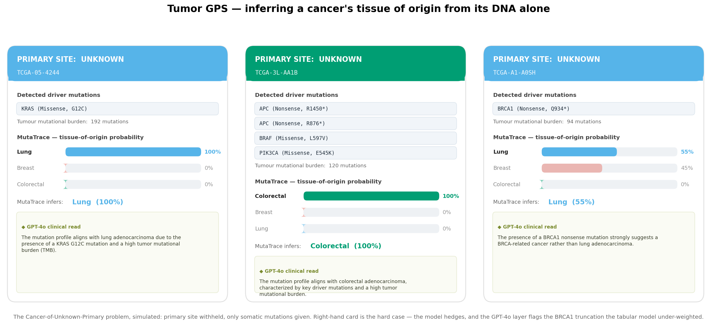

# MutaTrace

### Inferring cancer tissue-of-origin from somatic mutation signatures

**A reproducible, end-to-end ML + foundation-model workflow that infers a tumour's tissue of origin from its somatic mutations alone — the core task in Cancer-of-Unknown-Primary diagnosis.**

> **Scope note:** tissue-of-origin classification is a well-established problem with substantial prior work. MutaTrace makes no novelty claim. Its value is clean, interpretable, fully reproducible execution on public data — a demonstration of workflow and craft, not a new method.

<sub>A case study by **Aikyam Inc.** — computational biology, built to a scientific standard. · [Interactive case-study page](https://claude.ai/code/artifact/a904842a-efc3-4fa2-b79e-ba9a18752f77)</sub>

---

## The problem this solves

In **3–5% of metastatic cancers**, the tumour is found but its *primary site cannot be identified* — Cancer of Unknown Primary (CUP). This is not an academic curiosity: nearly every cancer therapy is chosen by tissue of origin. An oncologist facing a CUP patient must choose treatment without knowing what they are treating, and CUP carries among the worst outcomes in oncology.

Modern tumour sequencing gives us the one thing that is always present: **the tumour's DNA**. Every cancer accumulates somatic mutations in a pattern shaped by the tissue it grew in and the mutational processes it endured. **MutaTrace reads that pattern and infers where the cancer started.**

> Feed in a tumour's somatic mutations. Read back a probability over tissues of origin — with a mutational-fingerprint breakdown and a plain-language clinical rationale.

---

## Result

**90.0% accuracy** inferring tissue of origin across three tissues (breast, lung, colorectal) on **2,098 real TCGA patients**, from somatic mutations alone — no imaging, no histology, no clinical metadata.

| | Breast | Lung | Colorectal | Overall |
|---|---|---|---|---|
| F1-score | 0.91 | 0.85 | 0.93 | **Acc 90.0% · Macro-F1 89.7%** |

Evaluated by 5-fold stratified cross-validation. Random baseline = 33%; majority-class baseline = 48%.

---

## The input data

Real, de-identified tumours from the **TCGA PanCancer Atlas 2018**, pulled live from the public [cBioPortal](https://www.cbioportal.org/) REST API. Nothing is simulated.

| | |
|---|---|
| **Source** | TCGA PanCancer Atlas 2018 · cBioPortal public API |
| **Assay** | Whole-exome somatic mutation calls (MAF-format variants) |
| **Build** | GRCh37 · trinucleotide context from Ensembl |
| **Cohorts** | Breast 1,009 · Lung 561 · Colorectal 528 = **2,098 patients** |
| **Scale** | **450,107 somatic mutations** (~215 per patient) |

**One input record is a single somatic mutation.** Example (a real row, `data/raw/LUAD_mutations.tsv`):

```
patient_id     TCGA-05-4244
gene           KRAS
chromosome     12
start_pos      25398285
ref_allele     C
alt_allele     A
variant_type   SNP
mutation_type  Missense_Mutation
protein_change G12C          ← the classic lung-cancer KRAS hotspot
cancer_type    LUAD          ← the label
```

Each patient's ~215 mutation records are aggregated by [`02_build_features.py`](scripts/02_build_features.py) into **one 187-feature profile** (gene matrix + TMB + SBS-6 + mutation-class + DNABERT PCs). Every figure in this repo is generated by a numbered script from this one API — reproducible end-to-end with `python scripts/01…08`.

---

## How it works — the mutational fingerprint

Cancer leaves forensic evidence in its own genome. MutaTrace reads three layers of it:

**1. Which genes are broken** — the driver architecture.
APC truncations dominate colorectal cancer; PIK3CA / GATA3 / CDH1 mark breast; EGFR / STK11 / KEAP1 mark lung. The oncoprint below shows each tissue carrying its own driver signature across 2,098 tumours.



**2. What caused the mutations** — the mutational signature.
The trinucleotide context of every point mutation encodes its origin: tobacco smoke leaves a C>A-heavy barcode (SBS4), APOBEC enzymes leave C>T/C>G at TpC sites (SBS2/13), an ageing clock leaves C>T at CpG (SBS1). These are the SBS-96 spectra — the most recognisable fingerprint in cancer genomics.



**3. Where in the genome, in what sequence context** — a genomic foundation model.
For each driver mutation, MutaTrace encodes 129 bp of surrounding DNA with **DNABERT** (a BERT model pre-trained on the human genome), capturing local sequence grammar — CpG context, repeats, splice proximity — that gene names and signatures alone miss.

These three layers become a 187-feature profile per patient, fed to a gradient-boosted classifier (**XGBoost**), interpreted with **SHAP**, and finally handed to a **GPT-4o** agent that writes a clinical rationale for each call.

---

## Tumor GPS — the CUP inference, one card at a time

Primary site withheld; only somatic mutations given. MutaTrace returns a tissue-of-origin probability and GPT-4o supplies the clinical read. The third card is the honest hard case: the model hedges (55/45) and narrowly misses, and the LLM layer flags the BRCA1 truncation the tabular model under-weighted.



---

## Pipeline

```
cBioPortal REST API  ──►  somatic mutations, 3 TCGA cohorts (2,098 patients, 450k mutations)
        │
        ├─► Driver architecture     top-150 gene mutation matrix
        ├─► Mutational signatures   SBS-96 trinucleotide spectra (Ensembl GRCh37 context)
        ├─► Sequence context        DNABERT 768-d embeddings of driver-mutation windows → PCA(20)
        └─► Burden & class          TMB, SBS-6 fractions, mutation-class fractions
        │
        ▼
   XGBoost  (5-fold stratified CV)  ─►  90% tissue-of-origin accuracy
        │
        ├─► SHAP        which features drove each tissue call
        └─► GPT-4o      LangGraph agent → clinical rationale per patient
```

| Script | Does |
|---|---|
| `01_download_data.py` | Pull TCGA somatic mutations + clinical data from cBioPortal (no account needed) |
| `02_build_features.py` | Gene matrix, TMB, SBS-6 and mutation-class features |
| `03_embed_mutations.py` | DNABERT embeddings of driver-mutation sequence context |
| `04_train_classifier.py` | XGBoost + 5-fold CV + SHAP + UMAP |
| `05_interpret.py` | GPT-4o LangGraph clinical-interpretation agent |
| `06_mutational_signatures.py` | SBS-96 mutational-signature spectra (the fingerprint) |
| `07_oncoprint.py` | Driver-gene oncoprint waterfall |
| `08_tumor_gps.py` | CUP "Tumor GPS" prediction cards (leak-free out-of-fold probabilities) |

---

## Data & honesty

- **Real patient tumours** — TCGA PanCancer Atlas 2018 (BRCA, LUAD, COAD), via the public [cBioPortal](https://www.cbioportal.org/) API. De-identified, publicly available.
- **No leakage in the demo cards** — Tumor GPS probabilities are out-of-fold (each patient scored by a model that never trained on them).
- **Curated drivers** — the oncoprint deliberately excludes TTN/MUC16 (long-gene artefacts that masquerade as drivers by mutation count).
- **Signatures are sampled** — SBS-96 spectra use seeded ~8,000-SNV samples per tissue (aggregate signatures are stable at this depth).

### What this is not
A validated clinical device. It is a rigorous proof of concept on three tissues. Real CUP classifiers span 20–30 tissue types and integrate copy-number, expression, and methylation — the natural extensions below.

## Extends to
- **All 33 TCGA tissues** (the architecture is class-agnostic)
- **Multi-omics** — copy number, RNA expression, methylation alongside mutations
- **Independent validation** — MSK-IMPACT / ICGC hold-out cohorts
- **Fine-tuned DNABERT** on somatic-mutation contexts (COSMIC)

---

## Run it

```bash
python3 -m venv .venv && source .venv/bin/activate
pip install -r requirements.txt
brew install libomp                 # macOS: XGBoost needs OpenMP
cp .env.example .env                # add your OpenAI key for step 05

python scripts/01_download_data.py  # ~10 min, pulls from cBioPortal
python scripts/02_build_features.py
python scripts/03_embed_mutations.py
python scripts/04_train_classifier.py
python scripts/05_interpret.py
python scripts/06_mutational_signatures.py
python scripts/07_oncoprint.py
python scripts/08_tumor_gps.py
```

See [RESULTS_AND_DISCUSSION.md](RESULTS_AND_DISCUSSION.md) for the full scientific write-up.

---

*Built on public TCGA data. No proprietary tools, no patient identifiers. A demonstration of applied ML + genomic foundation models + LLM reasoning on a real clinical problem.*

---

### About Aikyam Inc.

**Aikyam Inc.** is a computational-biology consultancy spanning cancer genomics, ML & genomic foundation models, drug discovery, and protein science. MutaTrace is one case study — real data, interpretable models, honest limits.

📫 [shilvaru@gmail.com](mailto:shilvaru@gmail.com) · [github.com/shilpasy](https://github.com/shilpasy)
